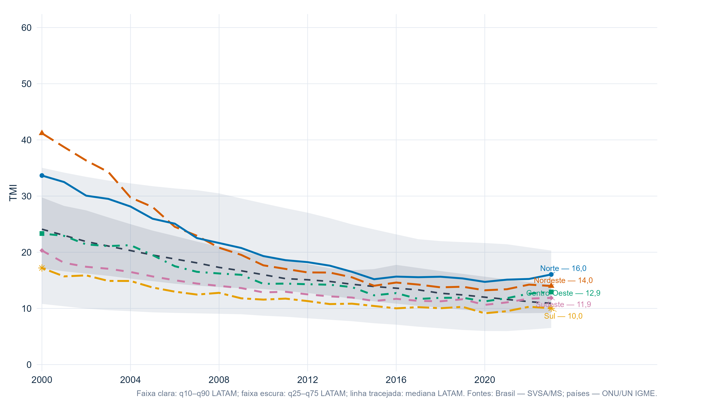
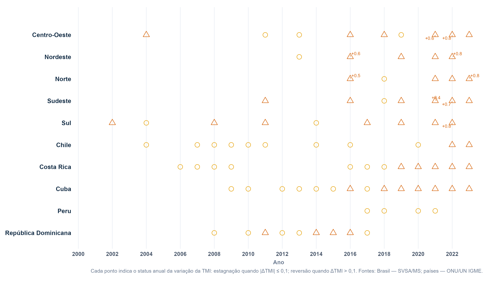
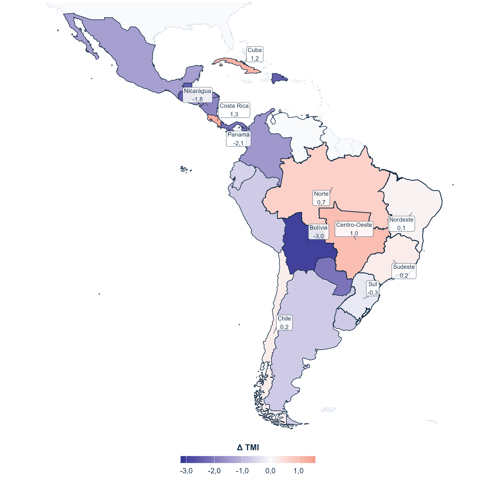
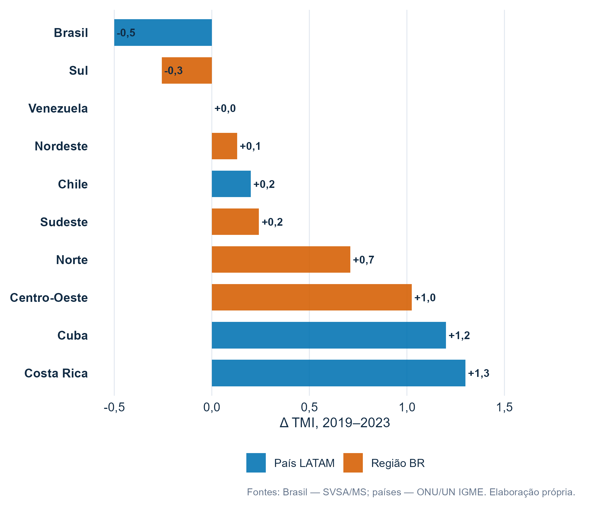
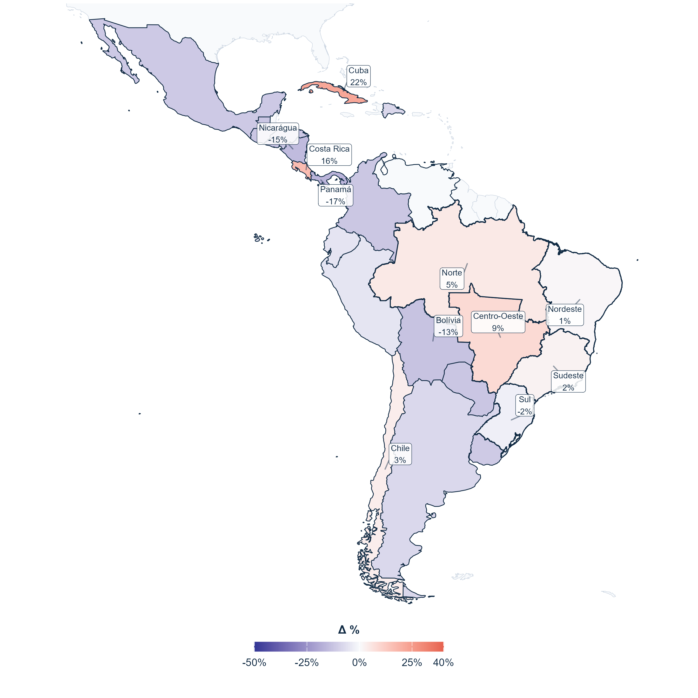
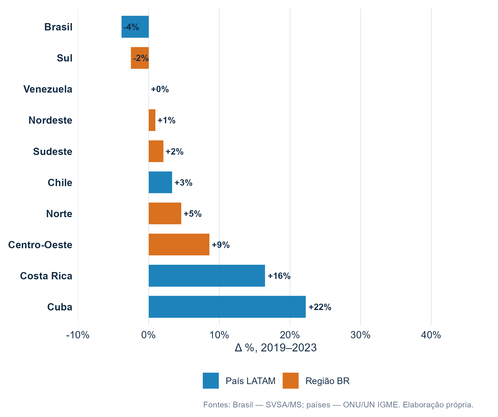

```{r}
source("R/00_setup.R")
```

## {.title-slide}

<div class="cover-slide">

<div class="cover-main">

<div class="cover-kicker">ALAP 2026 · Mortalidade infantil · América Latina</div>

<div class="cover-title">
Gradientes de Mortalidade Infantil no Brasil em Perspectiva Latino-Americana
</div>

<div class="cover-authors">
Uriel Brasileiro Holanda · Karys Emanuelle Alves · Jorge Souza Alves<br>
Jevuks Matheus de Araujo · Everlane Suane de Araújo da Silva
</div>

<div class="cover-affiliations">
<span>UFPB · LEAP · UFMG · IBGE/PB · LED</span>
</div>

<div class="cover-date">
18 de junho de 2026
</div>

</div>

<div class="cover-side">

<div class="cover-logo-box">

</div>

<div class="cover-side-note">
Taxa de Mortalidade Infantil · 2000–2023
</div>

</div>

</div>


## Motivação {#motivacao .text-slide}

<div class="slide-mid-content">

<div class="section-tag">Contexto e pergunta</div>

<div class="motivation-grid">

<div class="motivation-main">

<div class="big-claim compact">
A queda agregada da mortalidade infantil pode ocultar desigualdades territoriais persistentes.
</div>

<div class="motivation-text">
O objetivo da apresentação é posicionar as cinco grandes regiões brasileiras dentro da distribuição latino-americana da Taxa de Mortalidade Infantil (TMI), identificar trajetórias semelhantes e discutir sinais de estagnação e reversão recente.
</div>

</div>

<div class="motivation-cards">

<div class="metric-card">
<div class="metric-label">Indicador</div>
<div class="metric-value">TMI</div>
<div class="metric-note">Óbitos de menores de 1 ano por 1.000 nascidos vivos.</div>
</div>

<div class="metric-card">
<div class="metric-label">Janela</div>
<div class="metric-value">2000–2023</div>
<div class="metric-note">Período comum entre a série brasileira e a série internacional.</div>
</div>

<div class="metric-card">
<div class="metric-label">Brasil</div>
<div class="metric-value">5 regiões</div>
<div class="metric-note">Norte, Nordeste, Centro-Oeste, Sudeste e Sul.</div>
</div>

<div class="metric-card">
<div class="metric-label">Comparação</div>
<div class="metric-value">LATAM</div>
<div class="metric-note">Países latino-americanos em série harmonizada.</div>
</div>

</div>

</div>

<div class="score-composition-card">

<div class="score-header">
<div>
<div class="metric-label">Desenho comparativo</div>
<div class="score-title">níveis, trajetórias, similaridade, estagnação e reversão</div>
</div>
<div class="score-badge">descritivo</div>
</div>

<div class="score-components">
<div class="score-component"><span>1</span><strong>Níveis</strong><small>TMI por região e país</small></div>
<div class="score-component"><span>2</span><strong>Trajetórias</strong><small>queda 2000–2023</small></div>
<div class="score-component"><span>3</span><strong>Similaridade</strong><small>regiões como países</small></div>
<div class="score-component"><span>4</span><strong>Estagnação</strong><small>perda de ritmo anual</small></div>
<div class="score-component"><span>5</span><strong>Reversão</strong><small>aumento em 2019–2023</small></div>
</div>

</div>


</div>

## Dados e estratégia {#dados .text-slide}

<div class="slide-mid-content">

<div class="section-tag">Dados e método</div>

<div class="data-grid">

<div class="data-main">

<div class="big-claim compact">
A comparação combina uma fonte nacional para o Brasil com uma fonte internacional harmonizada para os países latino-americanos.
</div>

<div class="data-text">
Para o Brasil, a série anual foi construída para o país e suas cinco grandes regiões a partir de informações do Ministério da Saúde/SVSA. Para o contexto latino-americano, a TMI dos países foi obtida a partir das estimativas harmonizadas do UN IGME/ONU, o que reduz problemas de comparação entre países com registros vitais de qualidade desigual.
</div>

</div>

<div class="data-cards">

<div class="metric-card">
<div class="metric-label">Brasil</div>
<div class="metric-value">MS/SVSA</div>
<div class="metric-note">Séries nacionais e regionais da TMI.</div>
</div>

<div class="metric-card">
<div class="metric-label">Países</div>
<div class="metric-value">UN IGME</div>
<div class="metric-note">Estimativas harmonizadas para comparação internacional.</div>
</div>

<div class="metric-card">
<div class="metric-label">Unidade espacial</div>
<div class="metric-value">regiões + países</div>
<div class="metric-note">Brasil desagregado; demais unidades como países.</div>
</div>

<div class="metric-card">
<div class="metric-label">Leitura</div>
<div class="metric-value">não causal</div>
<div class="metric-note">Exercício descritivo e comparativo.</div>
</div>

</div>

</div>


</div>

## Queda como processo {#queda .dashboard-slide}

<div class="dash-result queda-interactive">

<div class="dash-top-row">

<div>
<div class="section-tag">Queda continental</div>
<div class="dash-title">
A TMI caiu em toda a América Latina, mas os gradientes persistiram
</div>
<div class="dash-subtitle">
Clique nos anos para comparar a TMI regional brasileira com países latino-americanos selecionados.
</div>
</div>

<div class="year-rail-box interactive-year-box">
<div class="year-rail tab-buttons" role="tablist" aria-label="Selecionar ano da TMI">
<button type="button" class="year-tick tab-button" data-tab-group="queda" data-tab-target="queda-2000">2000</button>
<button type="button" class="year-tick tab-button" data-tab-group="queda" data-tab-target="queda-2008">2008</button>
<button type="button" class="year-tick tab-button" data-tab-group="queda" data-tab-target="queda-2016">2016</button>
<button type="button" class="year-tick tab-button active" data-tab-group="queda" data-tab-target="queda-2023">2023</button>
</div>
<div class="year-rail-caption">clique para trocar o mapa</div>
</div>

</div>

```{r queda-interactive-panels, results='asis'}
queda_box_path <- file.path("figures", "dash", "data_queda_box_years.csv")

if (!file.exists(queda_box_path)) {
  stop(
    "Não encontrei figures/dash/data_queda_box_years.csv. ",
    "Rode source('R/02_figures_dash.R') antes de renderizar a apresentação."
  )
}

queda_box_years <- readr::read_csv(queda_box_path, show_col_types = FALSE) |>
  dplyr::mutate(
    year = as.integer(year),
    unit = stringr::str_squish(as.character(unit)),
    type = stringr::str_squish(as.character(type)),
    tmi = suppressWarnings(as.numeric(tmi)),
    unit_order = as.integer(unit_order)
  ) |>
  dplyr::filter(is.finite(tmi)) |>
  dplyr::arrange(year, unit_order)

years_to_show <- c(2000L, 2008L, 2016L, 2023L)

cat('<div class="queda-tabs-shell">')

for (ano in years_to_show) {
  dados_ano <- queda_box_years |>
    dplyr::filter(year == ano) |>
    dplyr::arrange(unit_order)

  active_class <- ifelse(ano == 2023L, " active", "")

  cat(sprintf(
    '<div id="queda-%s" class="tab-panel queda-tab-panel%s" data-tab-group="queda">',
    ano, active_class
  ))

  cat('<div class="queda-interactive-panel">')

  cat('<div class="values-side-card queda-year-card">')
  cat(sprintf('<div class="metric-label">TMI em %s</div>', ano))

  max_tmi <- max(dados_ano$tmi, na.rm = TRUE)

  for (i in seq_len(nrow(dados_ano))) {
    unidade <- htmltools::htmlEscape(dados_ano$unit[i])
    valor <- scales::number(dados_ano$tmi[i], accuracy = 0.1, decimal.mark = ",")

    classe <- ifelse(
      abs(dados_ano$tmi[i] - max_tmi) < 1e-8,
      "value-row highlight",
      "value-row"
    )

    cat(sprintf(
      '<div class="%s"><span>%s</span><strong>%s</strong></div>',
      classe, unidade, valor
    ))
  }

  cat('<div class="values-note">A unidade destacada é a maior TMI entre as regiões e países selecionados neste ano.</div>')
  cat('</div>')

  cat('<div class="main-map-panel">')
  cat(sprintf(
    '',
    ano, ano
  ))
  cat('</div>')

  cat('</div>')
  cat('</div>')
}

cat('</div>')
```

</div>

## Queda acumulada {#queda-acumulada .dashboard-slide}

<div class="dash-result queda-acumulada-slide">

<div class="dash-top-row">

<div>
<div class="section-tag">Queda acumulada</div>
<div class="dash-title">
Entre 2000 e 2023, a melhora foi grande, mas desigual
</div>
<div class="dash-subtitle">
A leitura acumulada mostra a redução bruta e relativa da TMI ao longo dos 24 anos de estudo.
</div>
</div>

<div class="year-rail-box interactive-year-box compact-mode-box">
<div class="year-rail tab-buttons" role="tablist" aria-label="Selecionar medida da queda acumulada">
<button type="button" class="year-tick tab-button active" data-tab-group="queda-acumulada" data-tab-target="queda-acum-abs">bruta</button>
<button type="button" class="year-tick tab-button" data-tab-group="queda-acumulada" data-tab-target="queda-acum-pct">relativa</button>
</div>
<div class="year-rail-caption">2000–2023</div>
</div>

</div>

```{r queda-acumulada-panels, results='asis'}
queda_acum_path <- file.path("figures", "dash", "data_queda_acumulada_2000_2023.csv")

if (!file.exists(queda_acum_path)) {
  stop(
    "Não encontrei figures/dash/data_queda_acumulada_2000_2023.csv. ",
    "Rode source('R/02_figures_dash.R') antes de renderizar a apresentação."
  )
}

queda_acum <- readr::read_csv(queda_acum_path, show_col_types = FALSE) |>
  dplyr::mutate(
    unit = stringr::str_squish(as.character(unit)),
    type = stringr::str_squish(as.character(type)),
    unit_order = as.integer(unit_order),
    queda_abs = as.numeric(queda_abs),
    queda_pct = as.numeric(queda_pct)
  ) |>
  dplyr::arrange(unit_order)

render_queda_acum_panel <- function(kind = c("abs", "pct")) {
  kind <- match.arg(kind)

  if (kind == "abs") {
    panel_id <- "queda-acum-abs"
    img <- "figures/dash/queda_acumulada_choropleth_abs_2000_2023.png"
    title <- "Queda bruta"
    note <- "Diferença em pontos de TMI: TMI 2000 menos TMI 2023."
    value_col <- "queda_abs"
    formatter <- function(x) scales::number(x, accuracy = 0.1, decimal.mark = ",")
    active <- " active"
  } else {
    panel_id <- "queda-acum-pct"
    img <- "figures/dash/queda_acumulada_choropleth_pct_2000_2023.png"
    title <- "Queda relativa"
    note <- "Redução percentual acumulada entre 2000 e 2023."
    value_col <- "queda_pct"
    formatter <- function(x) paste0(scales::number(x, accuracy = 1, decimal.mark = ","), "%")
    active <- ""
  }

  cat(sprintf(
    '<div id="%s" class="tab-panel queda-tab-panel%s" data-tab-group="queda-acumulada">',
    panel_id, active
  ))

  cat('<div class="queda-interactive-panel">')

  cat('<div class="values-side-card queda-year-card">')
  cat(sprintf('<div class="metric-label">%s</div>', title))

  max_val <- max(queda_acum[[value_col]], na.rm = TRUE)

  for (i in seq_len(nrow(queda_acum))) {
    unidade <- htmltools::htmlEscape(queda_acum$unit[i])
    valor <- formatter(queda_acum[[value_col]][i])

    classe <- ifelse(
      abs(queda_acum[[value_col]][i] - max_val) < 1e-8,
      "value-row highlight",
      "value-row"
    )

    cat(sprintf(
      '<div class="%s"><span>%s</span><strong>%s</strong></div>',
      classe, unidade, valor
    ))
  }

  cat(sprintf('<div class="values-note">%s</div>', note))
  cat('</div>')

  cat('<div class="main-map-panel">')
  cat(sprintf(
    '',
    img, title
  ))
  cat('</div>')

  cat('</div>')
  cat('</div>')
}

cat('<div class="queda-tabs-shell">')
render_queda_acum_panel("abs")
render_queda_acum_panel("pct")
cat('</div>')
```

</div>


## Gradientes brasileiros no tempo {#queda-series .dashboard-slide}

<div class="dash-result">

<div class="dash-top-row">

<div>
<div class="section-tag">Trajetórias</div>
<div class="dash-title">
As regiões brasileiras permaneceram em posições distintas da distribuição latino-americana
</div>
<div class="dash-subtitle">
Faixas mostram a distribuição dos países latino-americanos; linhas destacam as grandes regiões brasileiras.
</div>
</div>

</div>

<div class="full-plot-panel tall-fit">

</div>

</div>


## Regiões brasileiras como países {#similaridade .dashboard-slide}

<div class="dash-result similarity-interactive">

<div class="dash-top-row">

<div>
<div class="section-tag">Similaridade</div>
<div class="dash-title">
Regiões brasileiras se aproximam de trajetórias observadas em países latino-americanos específicos
</div>
<div class="dash-subtitle">
Selecione uma região para comparar sua série histórica com os três países mais próximos segundo o score composto.
</div>
</div>

<div class="region-tabs-horizontal" role="tablist" aria-label="Selecionar região brasileira">
<button type="button" class="region-pill tab-button active" data-tab-group="similaridade" data-tab-target="sim-norte">Norte</button>
<button type="button" class="region-pill tab-button" data-tab-group="similaridade" data-tab-target="sim-nordeste">Nordeste</button>
<button type="button" class="region-pill tab-button" data-tab-group="similaridade" data-tab-target="sim-centro_oeste">Centro-Oeste</button>
<button type="button" class="region-pill tab-button" data-tab-group="similaridade" data-tab-target="sim-sudeste">Sudeste</button>
<button type="button" class="region-pill tab-button" data-tab-group="similaridade" data-tab-target="sim-sul">Sul</button>
</div>

</div>

```{r similaridade-interactive-panels, results='asis'}
sim_regions <- c("Norte", "Nordeste", "Centro-Oeste", "Sudeste", "Sul")

sim_slug <- function(x) {
  x |>
    as.character() |>
    iconv(to = "ASCII//TRANSLIT") |>
    stringr::str_to_lower() |>
    stringr::str_replace_all("[^a-z0-9]+", "_") |>
    stringr::str_replace_all("^_|_$", "")
}

sim_matches_path <- file.path("figures", "dash", "data_top_matches_by_region.csv")
sim_values_path  <- file.path("figures", "dash", "data_queda_box_years.csv")

if (!file.exists(sim_matches_path)) {
  stop(
    "Não encontrei figures/dash/data_top_matches_by_region.csv. ",
    "Rode source('R/02_figures_dash.R') antes de renderizar a apresentação."
  )
}

if (!file.exists(sim_values_path)) {
  stop(
    "Não encontrei figures/dash/data_queda_box_years.csv. ",
    "Rode source('R/02_figures_dash.R') antes de renderizar a apresentação."
  )
}

sim_matches <- readr::read_csv(sim_matches_path, show_col_types = FALSE) |>
  dplyr::mutate(
    region = stringr::str_squish(as.character(region)),
    country = stringr::str_squish(as.character(country)),
    rank = as.integer(rank),
    score_dash = as.numeric(score_dash)
  )

sim_values <- readr::read_csv(sim_values_path, show_col_types = FALSE) |>
  dplyr::mutate(
    unit = stringr::str_squish(as.character(unit)),
    year = as.integer(year),
    tmi = as.numeric(tmi)
  )

render_similarity_panel <- function(reg, is_active = FALSE) {
  reg_slug <- sim_slug(reg)
  panel_id <- paste0("sim-", reg_slug)
  active_class <- if (is_active) " active" else ""

  reg_values <- sim_values |>
    dplyr::filter(unit == reg, year %in% c(2000L, 2023L)) |>
    dplyr::arrange(year)

  tmi_2000 <- reg_values |> dplyr::filter(year == 2000L) |> dplyr::pull(tmi)
  tmi_2023 <- reg_values |> dplyr::filter(year == 2023L) |> dplyr::pull(tmi)

  tmi_2000 <- if (length(tmi_2000) == 0) NA_real_ else tmi_2000[1]
  tmi_2023 <- if (length(tmi_2023) == 0) NA_real_ else tmi_2023[1]
  var_pct <- 100 * (tmi_2023 / tmi_2000 - 1)

  top3 <- sim_matches |>
    dplyr::filter(region == reg) |>
    dplyr::arrange(score_dash) |>
    dplyr::slice_head(n = 3)

  top3_html <- paste0(
    sprintf(
      '<span>%s</span>',
      htmltools::htmlEscape(top3$country)
    ),
    collapse = ""
  )

  cat(sprintf(
    '<div id="%s" class="tab-panel similarity-tab-panel%s" data-tab-group="similaridade">',
    panel_id, active_class
  ))

  cat('<div class="similarity-main-layout">')

  cat('<div class="main-plot-panel">')
  cat(sprintf(
    '',
    reg_slug, htmltools::htmlEscape(reg)
  ))
  cat('</div>')

  cat('<div class="similarity-side-panel">')

  cat('<div class="native-summary-card">')
  cat('<div class="metric-label">Região selecionada</div>')
  cat(sprintf('<div class="native-region-name">%s</div>', htmltools::htmlEscape(reg)))

  cat('<div class="native-metrics-grid">')
  cat(sprintf(
    '<div><span>2000</span><strong>%s</strong></div>',
    scales::number(tmi_2000, accuracy = 0.1, decimal.mark = ",")
  ))
  cat(sprintf(
    '<div><span>2023</span><strong>%s</strong></div>',
    scales::number(tmi_2023, accuracy = 0.1, decimal.mark = ",")
  ))
  cat(sprintf(
    '<div><span>Variação</span><strong>%s%%</strong></div>',
    scales::number(var_pct, accuracy = 1, decimal.mark = ",")
  ))
  cat('</div>')

  cat('<div class="native-match-list">')
  cat(top3_html)
  cat('</div>')
  cat('</div>')

  cat('<div class="small-plot-panel">')
  cat(sprintf(
    '',
    reg_slug, htmltools::htmlEscape(reg)
  ))
  cat('</div>')

  cat('</div>')
  cat('</div>')
  cat('</div>')
}

cat('<div class="similarity-tabs-shell">')
purrr::walk2(sim_regions, seq_along(sim_regions), ~ render_similarity_panel(.x, is_active = .y == 1))
cat('</div>')
```

</div>


## Estagnação e reversão anual {#estagnacao .dashboard-slide}

<div class="dash-result estag-v6">

<div class="dash-top-row">
<div>
<div class="section-tag">Interrupções da queda</div>
<div class="dash-title">
A queda da TMI não foi linear: houve platôs e perda de ritmo
</div>
<div class="dash-subtitle">
Episódios de estagnação prolongada e reversões localizadas dentro de trajetórias gerais de queda.
</div>
</div>
</div>

<div class="estag-v6-body">

<div class="estag-v6-strip">

<div class="estag-v6-card">
<span>Mais longo</span>
<strong>Rep. Dominicana</strong>
<small>2005–2018 · 13 anos</small>
</div>

<div class="estag-v6-card">
<span>Brasil</span>
<strong>5 regiões</strong>
<small>todas com estagnação prolongada</small>
</div>

<div class="estag-v6-card">
<span>Leitura</span>
<strong>perda de ritmo</strong>
<small>sinais aparecem antes da reversão recente</small>
</div>

</div>

<div class="estag-v6-plot">

<div class="estag-plot-image-wrap">

</div>

<div class="estag-html-legend">
<span><b class="legend-circle">○</b> Estagnação</span>
<span><b class="legend-triangle">△</b> Reversão</span>
<span class="legend-note">Estagnação: |ΔTMI| ≤ 0,1 · Reversão: ΔTMI &gt; 0,1</span>
</div>

</div>

</div>

</div>

## Reversão recente {#reversao .dashboard-slide}

<div class="dash-result rev-v6">

<div class="dash-top-row">
<div>
<div class="section-tag">Reversão recente</div>
<div class="dash-title">
Entre 2019 e 2023, parte do continente voltou a registrar aumento da TMI
</div>
<div class="dash-subtitle">
A reversão recente pode ser lida em pontos de TMI ou como variação percentual.
</div>
</div>

<div class="year-rail-box interactive-year-box compact-mode-box">
<div class="year-rail tab-buttons" role="tablist" aria-label="Selecionar medida da reversão recente">
<button type="button" class="year-tick tab-button active" data-tab-group="reversao" data-tab-target="reversao-abs">bruta</button>
<button type="button" class="year-tick tab-button" data-tab-group="reversao" data-tab-target="reversao-pct">relativa</button>
</div>
<div class="year-rail-caption">2019–2023</div>
</div>

</div>

<div class="reversao-tabs-shell">

<div id="reversao-abs" class="tab-panel active" data-tab-group="reversao">

<div class="rev-v6-grid">

<div class="rev-v6-map-card">
<div class="rev-v6-map-image">

</div>
<div class="rev-v6-legend rev-v6-legend-abs">
  <div class="rev-v6-legend-title">Δ TMI, 2019–2023</div>
  <div class="rev-v6-legend-scale">
    <div class="rev-v6-legend-bar">
      <span class="tick tick-m3"></span>
      <span class="tick tick-m2"></span>
      <span class="tick tick-m1"></span>
      <span class="tick tick-0"></span>
      <span class="tick tick-1"></span>
    </div>
    <div class="rev-v6-legend-labels">
      <span class="label-m3">-3</span>
      <span class="label-m2">-2</span>
      <span class="label-m1">-1</span>
      <span class="label-0">0</span>
      <span class="label-1">1</span>
    </div>
  </div>
</div>
</div>

<div class="rev-v6-side">

<div class="rev-v6-rank">

</div>

<div class="rev-v6-brief">
<div class="rev-v6-brief-item">
<strong>Leitura bruta</strong>
<span>Mostra quantos pontos de TMI foram adicionados ou reduzidos entre 2019 e 2023.</span>
</div>
<div class="rev-v6-brief-item">
<strong>Quatro das cinco regiões</strong>
<span>Centro-Oeste, Norte, Sudeste e Nordeste registraram aumento; apenas o Sul caiu.</span>
</div>
<div class="rev-v6-brief-item">
<strong>Maior aumento</strong>
<span>Costa Rica e Cuba aparecem entre os maiores acréscimos absolutos.</span>
</div>
</div>

</div>

</div>

</div>

<div id="reversao-pct" class="tab-panel" data-tab-group="reversao">

<div class="rev-v6-grid">

<div class="rev-v6-map-card">
<div class="rev-v6-map-image">

</div>
<div class="rev-v6-legend rev-v6-legend-pct">
  <div class="rev-v6-legend-title">Δ %, 2019–2023</div>
  <div class="rev-v6-legend-scale">
    <div class="rev-v6-legend-bar">
      <span class="tick tick-m50"></span>
      <span class="tick tick-m25"></span>
      <span class="tick tick-0"></span>
      <span class="tick tick-25"></span>
      <span class="tick tick-40"></span>
    </div>
    <div class="rev-v6-legend-labels">
      <span class="label-m50">-50%</span>
      <span class="label-m25">-25%</span>
      <span class="label-0">0</span>
      <span class="label-25">25%</span>
      <span class="label-40">40%</span>
    </div>
  </div>
</div>
</div>

<div class="rev-v6-side">

<div class="rev-v6-rank">

</div>

<div class="rev-v6-brief">
<div class="rev-v6-brief-item">
<strong>Leitura relativa</strong>
<span>Mostra o aumento proporcional em relação ao nível observado em 2019.</span>
</div>
<div class="rev-v6-brief-item">
<strong>Mais sensível a níveis baixos</strong>
<span>Países com TMI inicial baixa podem aparecer mais fortes na variação percentual.</span>
</div>
<div class="rev-v6-brief-item">
<strong>Complementa a leitura bruta</strong>
<span>A variação percentual ajuda a ver intensidade relativa, mas não substitui o número absoluto.</span>
</div>
</div>

</div>

</div>

</div>

</div>

</div>

## Síntese {#sintese .text-slide}

<div class="slide-mid-content synthesis-mid-content">

<div class="section-tag">Síntese</div>

<div class="text-slide-lead">
Três mensagens centrais da apresentação
</div>
<div class="text-slide-subtitle">
O declínio da mortalidade infantil foi amplo, mas não homogêneo.
</div>

<div class="takeaway-grid">

<div class="takeaway-card">
<div class="takeaway-number">1</div>
<div class="takeaway-title">Queda continental</div>
<div class="takeaway-text">
A TMI caiu em toda a América Latina entre 2000 e 2023, inclusive em todas as grandes regiões brasileiras.
</div>
</div>

<div class="takeaway-card">
<div class="takeaway-number">2</div>
<div class="takeaway-title">Brasil como mosaico latino-americano</div>
<div class="takeaway-text">
As grandes regiões brasileiras ocupam posições comparáveis às de países distintos da região, revelando forte heterogeneidade interna.
</div>
</div>

<div class="takeaway-card">
<div class="takeaway-number">3</div>
<div class="takeaway-title">Estagnação e reversão</div>
<div class="takeaway-text">
A trajetória de queda não foi linear: houve anos de estagnação e reversões recentes em alguns territórios.
</div>
</div>

</div>

<div class="closing-panel">
<div class="closing-kicker">Implicação substantiva</div>
<div class="closing-main">
Ler o Brasil apenas pela média nacional oculta desigualdades territoriais relevantes na dinâmica da mortalidade infantil.
</div>
</div>

</div>

## Referências {#referencias .text-slide}

<div class="slide-mid-content refs-mid-content">

<div class="section-tag">Referências principais</div>

<div class="refs-title">
Mortalidade infantil, desigualdades e contexto latino-americano
</div>

<div class="refs-grid-expanded">

<div>
<ul>
<li>Boing, A. F.; Boing, A. C. <em>Modestos avanços, persistentes desigualdades: mortalidade de crianças no Brasil de 2010 a 2022</em>. Revista de Saúde Pública, 2025.</li>
<li>Castro, A. <em>Maternal and child mortality worsens in Latin America and the Caribbean</em>. The Lancet, 2020.</li>
<li>Cavalcanti, D. M. et al. <em>Evaluation and Forecasting Analysis of Conditional Cash Transfer With Child Mortality in Latin America, 2000–2030</em>. JAMA Network Open, 2023.</li>
<li>Cavalcanti, D. M. et al. <em>Health effects of the Brazilian Conditional Cash Transfer programme over 20 years and projections to 2030</em>. The Lancet Regional Health – Americas, 2025.</li>
<li>Moncayo, A. L. et al. <em>Can primary health care mitigate the effects of economic crises on child health in Latin America?</em> The Lancet Regional Health – Americas, 2024.</li>
</ul>
</div>

<div>
<ul>
<li>PAHO. <em>Mitigating the Indirect Impacts of COVID-19 on Maternal, Newborn, Child and Adolescent Health Services: Lessons Learned from Brazil</em>. 2022.</li>
<li>Amaral Junior, O. L. et al. <em>Correlation between structural determinants and universal health coverage in 2010 and 2019</em>. PLOS Global Public Health, 2025.</li>
<li>UN IGME. <em>Levels and Trends in Child Mortality</em>. UNICEF, WHO, World Bank Group, UN DESA, 2020/2023.</li>
<li>Ministério da Saúde / SVSA. <em>Taxa de mortalidade infantil: indicadores de mortalidade</em>. 2025.</li>
<li>Nações Unidas / IPEA. <em>Objetivo de Desenvolvimento Sustentável 3: saúde e bem-estar</em>.</li>
</ul>
</div>

</div>

</div>
